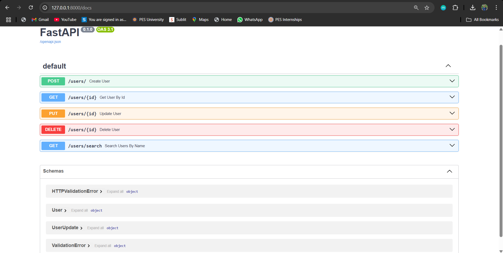

# ⚡ FastAPI User Management CRUD API

**FastAPI User Management CRUD API** is a **high-performance, Python-based RESTful API** built with **FastAPI**, offering full **Create, Read, Update, Delete (CRUD)** operations for managing users. It uses **SQLite** as the database and SQLAlchemy ORM for seamless integration.

---

## 🔗 Live Demo

👉 [Try the Live API](https://fastapi-user-management-crud-api.onrender.com/docs)

---

## 📺 Screenshot

---

## 🚀 Features

- ✅ Create a new user  
- 🔍 Get all users  
- 🔎 Get a specific user by ID  
- ✏️ Update user details  
- ❌ Delete a user by ID  
- ⚡ FastAPI Swagger UI for interactive documentation at `/docs`
- 📊 SQLite integration using SQLAlchemy ORM
- 🗂️ Modular project structure (models, database, main)

---

## 🛠 Tech Stack

- Python 3  
- FastAPI
- pydantic
- Uvicorn 

---

## 📑 API Endpoints

| Method | Endpoint       | Description             |
|--------|----------------|-------------------------|
| GET    | `/`            | Welcome message         |
| POST   | `/users/`      | Create a new user       |
| GET    | `/users/`      | Get all users           |
| GET    | `/users/{id}`  | Get user by ID          |
| PUT    | `/users/{id}`  | Update user by ID       |
| DELETE | `/users/{id}`  | Delete user by ID       |

---

## How to Run 

### 1️⃣ Clone the repository
``git clone https://github.com/Tirthraj1605/FastAPI-User-Management-CRUD-API.git``
``cd FastAPI-User-Management-CRUD-API``

### 2️⃣ Create and activate a virtual environment (optional but recommended)
``python -m venv venv``
### On Windows
``venv\Scripts\activate``
### On Linux/macOS
``source venv/bin/activate``

### 3️⃣ Install dependencies
``pip install -r requirements.txt``

### 4️⃣ Run the FastAPI app
``uvicorn main:app --reload``

---

## Author 
- Tirthraj Bhalodiya
- tirthrajbhalodiya2003@gmail.com
- [LinkedIn](https://www.linkedin.com/in/tirthraj-bhalodiya-97534b227/)

